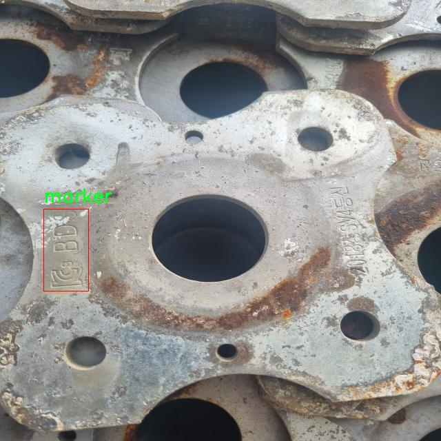

### 1.背景意义

研究背景与意义

铸造工艺在现代制造业中占据着重要地位，尤其是在汽车、航空航天和重型机械等领域。随着技术的不断进步，铸件的质量和精度要求也日益提高。铸件表面的标记定位不仅是确保产品质量的重要环节，也是实现自动化生产、提高生产效率的关键因素之一。传统的铸件表面标记定位方法多依赖人工检查，效率低且容易出现误差，难以满足现代生产的需求。因此，开发一种高效、准确的铸件表面标记定位系统显得尤为重要。

在计算机视觉领域，目标检测技术的迅速发展为铸件表面标记定位提供了新的解决方案。YOLO（You Only Look Once）系列模型以其高效的实时检测能力和较高的准确率，成为目标检测领域的热门选择。YOLOv11作为该系列的最新版本，结合了深度学习的先进技术，具备更强的特征提取能力和更快的推理速度，适合在铸件表面标记定位任务中应用。

本研究旨在基于改进的YOLOv11模型，构建一个铸件表面标记定位系统。该系统将利用一个包含258张图像的数据集，专注于单一类别的标记检测。通过对数据集的精细标注和处理，系统将能够实现对铸件表面标记的高效定位，显著提高生产线的自动化水平和检测精度。此外，研究还将探讨数据集的优化和模型的改进策略，以进一步提升系统的性能。

总之，基于改进YOLOv11的铸件表面标记定位系统不仅具有重要的理论意义，也为实际生产提供了切实可行的解决方案，推动了铸造行业的智能化进程。

### 2.视频效果

[2.1 视频效果](https://www.bilibili.com/video/BV1rCU6Y1E4s/)

### 3.图片效果


##### [项目涉及的源码数据来源链接](https://kdocs.cn/l/cszuIiCKVNis)**

注意：本项目提供训练的数据集和训练教程,由于版本持续更新,暂不提供权重文件（best.pt）,请按照6.训练教程进行训练后实现上图演示的效果。

### 4.数据集信息

##### 4.1 本项目数据集类别数＆类别名

nc: 1
names: ['marker']


该项目为【目标检测】数据集，请在【训练教程和Web端加载模型教程（第三步）】这一步的时候按照【目标检测】部分的教程来训练

##### 4.2 本项目数据集信息介绍

本项目数据集信息介绍

本项目所使用的数据集专注于铸件表面标记的定位，旨在改进YOLOv11模型的性能，以实现更高效的铸件检测和标记识别。数据集的主题围绕“mm”展开，强调了在铸件表面微小标记的精准定位。该数据集包含单一类别，即“marker”，这意味着所有的样本均为铸件表面上的标记，旨在为模型提供一致且明确的训练目标。

在数据集的构建过程中，我们采集了大量的铸件图像，这些图像展示了不同类型的铸件表面及其上所附加的标记。这些标记可能因铸件的生产工艺、材料特性及环境因素而有所不同，因此数据集中包含了多种不同的铸件表面纹理和光照条件，以确保模型在各种实际应用场景中的鲁棒性和适应性。此外，数据集还考虑了标记的大小、形状和颜色的多样性，以提高模型对不同标记的识别能力。

为了确保数据集的高质量，我们对采集的图像进行了严格的筛选和标注，确保每个标记的位置和特征都被准确记录。这一过程不仅提高了数据集的准确性，也为后续的模型训练提供了坚实的基础。通过使用该数据集，我们期望能够训练出一个高效的铸件表面标记定位系统，从而在铸造行业中实现更高的自动化水平和生产效率。最终，项目的成功将为铸件生产的质量控制和追溯体系提供有力支持，推动行业的智能化发展。





### 5.全套项目环境部署视频教程（零基础手把手教学）

[5.1 所需软件PyCharm和Anaconda安装教程（第一步）](https://www.bilibili.com/video/BV1BoC1YCEKi/?spm_id_from=333.999.0.0&vd_source=bc9aec86d164b67a7004b996143742dc)


[5.2 安装Python虚拟环境创建和依赖库安装视频教程（第二步）](https://www.bilibili.com/video/BV1ZoC1YCEBw?spm_id_from=333.788.videopod.sections&vd_source=bc9aec86d164b67a7004b996143742dc)

### 6.改进YOLOv11训练教程和Web_UI前端加载模型教程（零基础手把手教学）

[6.1 改进YOLOv11训练教程和Web_UI前端加载模型教程（第三步）](https://www.bilibili.com/video/BV1BoC1YCEhR?spm_id_from=333.788.videopod.sections&vd_source=bc9aec86d164b67a7004b996143742dc)


按照上面的训练视频教程链接加载项目提供的数据集，运行train.py即可开始训练



     Epoch   gpu_mem       box       obj       cls    labels  img_size
     1/200     20.8G   0.01576   0.01955  0.007536        22      1280: 100%|██████████| 849/849 [14:42<00:00,  1.04s/it]
               Class     Images     Labels          P          R     mAP@.5 mAP@.5:.95: 100%|██████████| 213/213 [01:14<00:00,  2.87it/s]
                 all       3395      17314      0.994      0.957      0.0957      0.0843

     Epoch   gpu_mem       box       obj       cls    labels  img_size
     2/200     20.8G   0.01578   0.01923  0.007006        22      1280: 100%|██████████| 849/849 [14:44<00:00,  1.04s/it]
               Class     Images     Labels          P          R     mAP@.5 mAP@.5:.95: 100%|██████████| 213/213 [01:12<00:00,  2.95it/s]
                 all       3395      17314      0.996      0.956      0.0957      0.0845

     Epoch   gpu_mem       box       obj       cls    labels  img_size
     3/200     20.8G   0.01561    0.0191  0.006895        27      1280: 100%|██████████| 849/849 [10:56<00:00,  1.29it/s]
               Class     Images     Labels          P          R     mAP@.5 mAP@.5:.95: 100%|███████   | 187/213 [00:52<00:00,  4.04it/s]
                 all       3395      17314      0.996      0.957      0.0957      0.0845


###### [项目数据集下载链接](https://kdocs.cn/l/cszuIiCKVNis)

### 7.原始YOLOv11算法讲解

YOLOv11是一种由Ultralytics公司开发的最新一代目标检测模型，以其增强的特征提取能力和更高的效率在计算机视觉领域引人注目。该模型在架构上进行了关键升级，通过更新主干和颈部结构，显著提高了对复杂视觉场景的理解和处理精度。YOLOv11不仅在目标检测上表现出色，还支持实例分割、图像分类、姿态估计和定向目标检测（OBB）等任务，展示出其多功能性。

与其前身YOLOv8相比，YOLOv11在设计上实现了深度和宽度的改变，同时引入了几个创新机制。其中，C3k2机制是对YOLOv8中的C2f的改进，提升了浅层特征的处理能力；C2PSA机制则进一步优化了特征图的处理流程。解耦头的创新设计，通过增加两个深度卷积（DWConv），提高了模型对细节的感知能力和分类准确性。

在性能上，YOLOv11m模型在COCO数据集上的平均精度（mAP）提高，并减少了22%的参数量，确保了在运算效率上的突破。该模型可以部署在多种平台上，包括边缘设备、云平台以及支持NVIDIA GPU的系统，彰显出卓越的灵活性和适应性。总体而言，YOLOv11通过一系列的创新突破，对目标检测领域产生了深远的影响，并为未来的开发提供了新的研究方向。


****文档**** ： _ _https://docs.ultralytics.com/models/yolo11/__

****代码链接**** ： _ _https://github.com/ultralytics/ultralytics__

******Performance Metrics******


​ ** **关键特性****

****◆**** ** **增强的特征提取能力**** ：YOLO11采用了改进的主干和颈部架构，增强了 ** **特征提取****
能力，能够实现更精确的目标检测和复杂任务的执行。

****◆**** ** **优化的效率和速度****
：YOLO11引入了精细化的架构设计和优化的训练流程，提供更快的处理速度，并在准确性和性能之间保持最佳平衡。

****◆**** ** **参数更少、精度更高****
：通过模型设计的改进，YOLO11m在COCO数据集上实现了更高的平均精度（mAP），同时使用的参数比YOLOv8m少22%，使其在计算上更加高效，而不牺牲准确性。

****◆**** ** **跨环境的适应性**** ：YOLO11可以无缝部署在各种环境中，包括边缘设备、云平台和支持NVIDIA
GPU的系统，确保最大的灵活性。

****◆**** ** **支持广泛任务****
：无论是目标检测、实例分割、图像分类、姿态估计还是定向目标检测（OBB），YOLO11都旨在应对一系列计算机视觉挑战。

****支持的任务和模式****


​YOLO11建立在YOLOv8中引入的多功能模型范围之上，为各种计算机视觉任务提供增强的支持:


​该表提供了YOLO11模型变体的概述，展示了它们在特定任务中的适用性以及与Inference、Validation、Training和Export等操作模式的兼容性。从实时检测到复杂的分割任务
，这种灵活性使YOLO11适用于计算机视觉的广泛应用。

##### yolov11的创新

■ yolov8 VS yolov11

YOLOv5，YOLOv8和YOLOv11均是ultralytics公司的作品，ultralytics出品必属精品。


​ **具体创新点** ：

**① 深度（depth）和宽度 （width）**

YOLOv8和YOLOv11是基本上完全不同。

**② C3k2机制**

C3k2有参数为c3k，其中在网络的浅层c3k设置为False。C3k2就相当于YOLOv8中的C2f。


​ **③ C2PSA机制**

下图为C2PSA机制的原理图。


​ **④ 解耦头**

解耦头中的分类检测头增加了两个 **DWConv** 。


▲Conv

    
    
    def autopad(k, p=None, d=1):  # kernel, padding, dilation
    
        """Pad to 'same' shape outputs."""
    
        if d > 1:
    
            k = d * (k - 1) + 1 if isinstance(k, int) else [d * (x - 1) + 1 for x in k]  # actual kernel-size
    
        if p is None:
    
            p = k // 2 if isinstance(k, int) else [x // 2 for x in k]  # auto-pad
    
    return p
    
    
    class Conv(nn.Module):
    
        """Standard convolution with args(ch_in, ch_out, kernel, stride, padding, groups, dilation, activation)."""
    
    
        default_act = nn.SiLU()  # default activation
    
    
        def __init__(self, c1, c2, k=1, s=1, p=None, g=1, d=1, act=True):
    
            """Initialize Conv layer with given arguments including activation."""
    
            super().__init__()
    
            self.conv = nn.Conv2d(c1, c2, k, s, autopad(k, p, d), groups=g, dilation=d, bias=False)
    
            self.bn = nn.BatchNorm2d(c2)
    
            self.act = self.default_act if act is True else act if isinstance(act, nn.Module) else nn.Identity()
    
    
        def forward(self, x):
    
            """Apply convolution, batch normalization and activation to input tensor."""
    
            return self.act(self.bn(self.conv(x)))
    
    
        def forward_fuse(self, x):
    
            """Perform transposed convolution of 2D data."""
    
            return self.act(self.conv(x))

▲Conv2d

    
    
    torch.nn.Conv2d(in_channels, out_channels, kernel_size, stride=1, padding=0, dilation=1, groups=1, bias=True, padding_mode='zeros')

▲DWConv

DWConv ** **代表 Depthwise Convolution（深度卷积）****
，是一种在卷积神经网络中常用的高效卷积操作。它主要用于减少计算复杂度和参数量。

    
    
    class DWConv(Conv):
    
        """Depth-wise convolution."""
    
    
        def __init__(self, c1, c2, k=1, s=1, d=1, act=True):  # ch_in, ch_out, kernel, stride, dilation, activation
    
            """Initialize Depth-wise convolution with given parameters."""
    
            super().__init__(c1, c2, k, s, g=math.gcd(c1, c2), d=d, act=act)


### 8.200+种全套改进YOLOV11创新点原理讲解

#### 8.1 200+种全套改进YOLOV11创新点原理讲解大全

由于篇幅限制，每个创新点的具体原理讲解就不全部展开，具体见下列网址中的改进模块对应项目的技术原理博客网址【Blog】（创新点均为模块化搭建，原理适配YOLOv5~YOLOv11等各种版本）

[改进模块技术原理博客【Blog】网址链接](https://gitee.com/qunmasj/good)


#### 8.2 精选部分改进YOLOV11创新点原理讲解

###### 这里节选部分改进创新点展开原理讲解(完整的改进原理见上图和[改进模块技术原理博客链接](https://gitee.com/qunmasj/good)【如果此小节的图加载失败可以通过CSDN或者Github搜索该博客的标题访问原始博客，原始博客图片显示正常】



### 视觉transformer(ViT)简介
视觉transformer(ViT)最近在各种计算机视觉任务中证明了巨大的成功，并受到了相当多的关注。与卷积神经网络(CNNs)相比，ViT具有更强的全局信息捕获能力和远程交互能力，表现出优于CNNs的准确性，特别是在扩大训练数据大小和模型大小时[An image is worth 16x16 words: Transformers for image recognition at scale,Coatnet]。

尽管ViT在低分辨率和高计算领域取得了巨大成功，但在高分辨率和低计算场景下，ViT仍不如cnn。例如，下图(左)比较了COCO数据集上当前基于cnn和基于vit的一级检测器。基于vit的检测器(160G mac)和基于cnn的检测器(6G mac)之间的效率差距超过一个数量级。这阻碍了在边缘设备的实时高分辨率视觉应用程序上部署ViT。


左图:现有的基于vit的一级检测器在实时目标检测方面仍然不如当前基于cnn的一级检测器，需要的计算量多出一个数量级。本文引入了第一个基于vit的实时对象检测器来弥补这一差距。在COCO上，efficientvit的AP比efficientdet高3.8，而mac较低。与YoloX相比，efficient ViT节省67.2%的计算成本，同时提供更高的AP。

中:随着输入分辨率的增加，计算成本呈二次增长，无法有效处理高分辨率的视觉应用。

右图:高分辨率对图像分割很重要。当输入分辨率从1024x2048降低到512x1024时，MobileNetV2的mIoU减少12% (8.5 mIoU)。在不提高分辨率的情况下，只提高模型尺寸是无法缩小性能差距的。

ViT的根本计算瓶颈是softmax注意模块，其计算成本随输入分辨率的增加呈二次增长。例如，如上图(中)所示，随着输入分辨率的增加，vit- small[Pytorch image models. https://github.com/rwightman/ pytorch-image-models]的计算成本迅速显著大于ResNet-152的计算成本。

解决这个问题的一个直接方法是降低输入分辨率。然而，高分辨率的视觉识别在许多现实世界的计算机视觉应用中是必不可少的，如自动驾驶，医疗图像处理等。当输入分辨率降低时，图像中的小物体和精细细节会消失，导致目标检测和语义分割性能显著下降。

上图(右)显示了在cityscape数据集上不同输入分辨率和宽度乘法器下MobileNetV2的性能。例如，将输入分辨率从1024x2048降低到512x1024会使cityscape的性能降低12% (8.5 mIoU)。即使是3.6倍高的mac，只放大模型尺寸而不增加分辨率也无法弥补这一性能损失。

除了降低分辨率外，另一种代表性的方法是限制softmax注意，方法是将其范围限制在固定大小的局部窗口内[Swin transformer,Swin transformer v2]或降低键/值张量的维数[Pyramid vision transformer,Segformer]。然而，它损害了ViT的非局部注意能力，降低了全局接受域(ViT最重要的优点)，使得ViT与大内核cnn的区别更小[A convnet for the 2020s,Scaling up your kernels to 31x31: Revisiting large kernel design in cnns,Lite pose: Efficient architecture design for 2d human pose estimation]。

本文介绍了一个有效的ViT体系结构，以解决这些挑战。发现没有必要坚持softmax注意力。本文建议用线性注意[Transformers are rnns: Fast autoregressive transformers with linear attention]代替softmax注意。

线性注意的关键好处是，它保持了完整的n 2 n^2n 2
 注意映射，就像softmax注意。同时，它利用矩阵乘法的联想特性，避免显式计算完整的注意映射，同时保持相同的功能。因此，它保持了softmax注意力的全局特征提取能力，且计算复杂度仅为线性。线性注意的另一个关键优点是它避免了softmax，这使得它在移动设备上更有效(下图左)。


左图:线性注意比类似mac下的softmax注意快3.3-4.5倍，这是因为去掉了硬件效率不高的softmax功能。延迟是在Qualcomm Snapdragon 855 CPU和TensorFlow-Lite上测量的。本文增加线性注意的头部数量，以确保它具有与softmax注意相似的mac。

中:然而，如果没有softmax注意中使用的非线性注意评分归一化，线性注意无法有效集中其注意分布，削弱了其局部特征提取能力。后文提供了可视化。

右图:本文用深度卷积增强线性注意，以解决线性注意的局限性。深度卷积可以有效地捕捉局部特征，而线性注意可以专注于捕捉全局信息。增强的线性注意在保持线性注意的效率和简单性的同时，表现出在各种视觉任务上的强大表现(图4)。

然而，直接应用线性注意也有缺点。以往的研究表明线性注意和softmax注意之间存在显著的性能差距(下图中间)。


左:高通骁龙855上的精度和延迟权衡。效率vit比效率网快3倍，精度更高。中:ImageNet上softmax注意与线性注意的比较。在相同的计算条件下，本文观察到softmax注意与线性注意之间存在显著的精度差距。而深度卷积增强模型后，线性注意的精度有明显提高。

相比之下，softmax注意的精度变化不大。在相同MAC约束下，增强线性注意比增强软最大注意提高了0.3%的精度。右图:与增强的softmax注意相比，增强的线性注意硬件效率更高，随着分辨率的增加，延迟增长更慢。

深入研究线性注意和softmax注意的详细公式，一个关键的区别是线性注意缺乏非线性注意评分归一化方案。这使得线性注意无法有效地将注意力分布集中在局部模式产生的高注意分数上，从而削弱了其局部特征提取能力。

本文认为这是线性注意的主要限制，使其性能不如softmax注意。本文提出了一个简单而有效的解决方案来解决这一限制，同时保持线性注意在低复杂度和低硬件延迟方面的优势。具体来说，本文建议通过在每个FFN层中插入额外的深度卷积来增强线性注意。因此，本文不需要依赖线性注意进行局部特征提取，避免了线性注意在捕捉局部特征方面的不足，并利用了线性注意在捕捉全局特征方面的优势。

本文广泛评估了efficient vit在低计算预算下对各种视觉任务的有效性，包括COCO对象检测、城市景观语义分割和ImageNet分类。本文想要突出高效的主干设计，所以没有包括任何正交的附加技术(例如，知识蒸馏，神经架构搜索)。尽管如此，在COCO val2017上，efficientvit的AP比efficientdet - d1高2.4倍，同时节省27.9%的计算成本。在cityscape上，efficientvit提供了比SegFormer高2.5个mIoU，同时降低了69.6%的计算成本。在ImageNet上，efficientvit在584M mac上实现了79.7%的top1精度，优于efficientnet - b1的精度，同时节省了16.6%的计算成本。

与现有的以减少参数大小或mac为目标的移动ViT模型[Mobile-former,Mobilevit,NASVit]不同，本文的目标是减少移动设备上的延迟。本文的模型不涉及复杂的依赖或硬件低效操作。因此，本文减少的计算成本可以很容易地转化为移动设备上的延迟减少。

在高通骁龙855 CPU上，efficient vit运行速度比efficientnet快3倍，同时提供更高的ImageNet精度。本文的代码和预训练的模型将在出版后向公众发布。

### Efficient Vision Transformer.
提高ViT的效率对于在资源受限的边缘平台上部署ViT至关重要，如手机、物联网设备等。尽管ViT在高计算区域提供了令人印象深刻的性能，但在针对低计算区域时，它通常不如以前高效的cnn[Efficientnet, mobilenetv3,Once for all: Train one network and specialize it for efficient deployment]。为了缩小差距，MobileViT建议结合CNN和ViT的长处，使用transformer将卷积中的局部处理替换为全局处理。MobileFormer提出了在MobileNet和Transformer之间建立双向桥以实现特征融合的并行化。NASViT提出利用神经架构搜索来搜索高效的ViT架构。

这些模型在ImageNet上提供了极具竞争力的准确性和效率的权衡。然而，它们并不适合高分辨率的视觉任务，因为它们仍然依赖于softmax注意力。


在本节中，本文首先回顾了自然语言处理中的线性注意，并讨论了它的优缺点。接下来，本文介绍了一个简单而有效的解决方案来克服线性注意的局限性。最后，给出了efficient vit的详细架构。

 为可学习投影矩阵。Oi表示矩阵O的第i行。Sim(·，·)为相似度函数。

虽然softmax注意力在视觉和NLP方面非常成功，但它并不是唯一的选择。例如，线性注意提出了如下相似度函数:


其中，φ(·)为核函数。在本工作中，本文选择了ReLU作为内核函数，因为它对硬件来说是友好的。当Sim(Q, K) = φ(Q)φ(K)T时，式(1)可改写为:


线性注意的一个关键优点是，它允许利用矩阵乘法的结合律，在不改变功能的情况下，将计算复杂度从二次型降低到线性型:


除了线性复杂度之外，线性注意的另一个关键优点是它不涉及注意模块中的softmax。Softmax在硬件上效率非常低。避免它可以显著减少延迟。例如，下图(左)显示了softmax注意和线性注意之间的延迟比较。在类似的mac上，线性注意力比移动设备上的softmax注意力要快得多。


#### EfficientViT
Enhancing Linear Attention with Depthwise Convolution

虽然线性注意在计算复杂度和硬件延迟方面优于softmax注意，但线性注意也有局限性。以往的研究[\[Luna: Linear unified nested attention,Random feature attention,Combiner: Full attention transformer with sparse computation cost,cosformer: Rethinking softmax in attention\]](https://afdian.net/item/602b9612927111ee9ec55254001e7c00)表明，在NLP中线性注意和softmax注意之间通常存在显著的性能差距。对于视觉任务，之前的研究[Visual correspondence hallucination,Quadtree attention for vision transformers]也表明线性注意不如softmax注意。在本文的实验中，本文也有类似的观察结果(图中)。


本文对这一假设提出了质疑，认为线性注意的低劣性能主要是由于局部特征提取能力的丧失。如果没有在softmax注意中使用的非线性评分归一化，线性注意很难像softmax注意那样集中其注意分布。下图(中间)提供了这种差异的示例。


在相同的原始注意力得分下，使用softmax比不使用softmax更能集中注意力。因此，线性注意不能有效地聚焦于局部模式产生的高注意分数(下图)，削弱了其局部特征提取能力。


注意图的可视化显示了线性注意的局限性。通过非线性注意归一化，softmax注意可以产生清晰的注意分布，如中间行所示。相比之下，线性注意的分布相对平滑，使得线性注意在捕捉局部细节方面的能力较弱，造成了显著的精度损失。本文通过深度卷积增强线性注意来解决这一限制，并有效提高了准确性。

介绍了一个简单而有效的解决方案来解决这个限制。本文的想法是用卷积增强线性注意，这在局部特征提取中是非常有效的。这样，本文就不需要依赖于线性注意来捕捉局部特征，而可以专注于全局特征提取。具体来说，为了保持线性注意的效率和简单性，本文建议在每个FFN层中插入一个深度卷积，这样计算开销很小，同时极大地提高了线性注意的局部特征提取能力。

#### Building Block

下图(右)展示了增强线性注意的详细架构，它包括一个线性注意层和一个FFN层，在FFN的中间插入深度卷积。


与之前的方法[Swin transformer,Coatnet]不同，本文在efficientvit中没有使用相对位置偏差。相对位置偏差虽然可以改善模型的性能，但它使模型容易受到分辨率变化[Segformer]的影响。多分辨率训练或新分辨率下的测试在检测和分割中很常见。去除相对位置偏差使高效率vit对输入分辨率更加灵活。

与之前低计算CNNs[Mobilenetv2,mobilenetv3]的设计不同，本文为下采样块添加了额外的下采样快捷方式。每个下采样快捷方式由一个平均池和一个1x1卷积组成。在本文的实验中，这些额外的下采样快捷方式可以稳定训练效率，提高性能。

#### Macro Architecture

下图说明了efficientvit的宏观体系结构。它由输入 stem 和4级组成。最近的研究[Coatnet,Levit,Early convolutions help transformers see better]表明在早期阶段使用卷积对ViT更好。本文遵循这个设计，在第三阶段开始使用增强的线性注意。


EfficientViT宏观架构。本文从第三阶段开始使用增强的线性注意。P2、P3和P4形成了一个金字塔特征图，用于检测和分割。P4用于分类。

为了突出高效的主干本身，本文对MBConv和FFN使用相同的扩展比e (e = 4)保持超参数简单，对所有深度卷积使用相同的内核大小k(除了输入stem)，对所有层使用相同的激活函数(hard swish)。

P2、P3和P4表示阶段2、3和4的输出，形成了特征图的金字塔。本文按照惯例将P2、P3和P4送至检测头。本文使用Yolov8进行检测。为了分割，本文融合了P2和P4。融合特征被馈送到一个轻量级头，包括几个卷积层，遵循Fast-SCNN。为了分类，本文将P4输入到轻量级头部，与MobileNetV3相同。


### 9.系统功能展示

图9.1.系统支持检测结果表格显示

  图9.2.系统支持置信度和IOU阈值手动调节

  图9.3.系统支持自定义加载权重文件best.pt(需要你通过步骤5中训练获得)

  图9.4.系统支持摄像头实时识别

  图9.5.系统支持图片识别

  图9.6.系统支持视频识别

  图9.7.系统支持识别结果文件自动保存

  图9.8.系统支持Excel导出检测结果数据


### 10. YOLOv11核心改进源码讲解

#### 10.1 test_selective_scan.py

以下是对代码的核心部分进行分析和详细注释的结果。我们将保留主要的功能实现，并对其进行解释。

```python
import torch
import torch.nn.functional as F
from einops import rearrange

def build_selective_scan_fn(selective_scan_cuda: object = None, mode="mamba_ssm"):
    """
    构建选择性扫描函数的工厂方法，根据给定的CUDA实现和模式返回相应的函数。
    """
    class SelectiveScanFn(torch.autograd.Function):
        @staticmethod
        def forward(ctx, u, delta, A, B, C, D=None, z=None, delta_bias=None, delta_softplus=False, return_last_state=False, nrows=1):
            """
            前向传播方法，计算选择性扫描的输出。
            """
            # 确保输入张量是连续的
            u = u.contiguous() if u.stride(-1) != 1 else u
            delta = delta.contiguous() if delta.stride(-1) != 1 else delta
            B = B.contiguous() if B.stride(-1) != 1 else B
            C = C.contiguous() if C.stride(-1) != 1 else C
            
            # 处理输入的维度
            if B.dim() == 3:
                B = rearrange(B, "b dstate l -> b 1 dstate l")
                ctx.squeeze_B = True
            if C.dim() == 3:
                C = rearrange(C, "b dstate l -> b 1 dstate l")
                ctx.squeeze_C = True
            
            # 确保输入的形状满足要求
            assert u.shape[1] % (B.shape[1] * nrows) == 0
            ctx.backnrows = nrows
            
            # 调用CUDA实现的前向函数
            out, x, *rest = selective_scan_cuda.fwd(u, delta, A, B, C, D, z, delta_bias, delta_softplus)
            
            # 保存上下文以供反向传播使用
            ctx.save_for_backward(u, delta, A, B, C, D, z, delta_bias, x)
            last_state = x[:, :, -1, 1::2]  # 获取最后的状态
            return (out, last_state) if return_last_state else out

        @staticmethod
        def backward(ctx, dout):
            """
            反向传播方法，计算梯度。
            """
            # 从上下文中恢复保存的张量
            u, delta, A, B, C, D, z, delta_bias, x = ctx.saved_tensors
            
            # 调用CUDA实现的反向函数
            du, ddelta, dA, dB, dC, dD, ddelta_bias, *rest = selective_scan_cuda.bwd(
                u, delta, A, B, C, D, z, delta_bias, dout, x, None, False
            )
            
            # 返回梯度
            return (du, ddelta, dA, dB, dC, dD, None, ddelta_bias, None)

    def selective_scan_fn(u, delta, A, B, C, D=None, z=None, delta_bias=None, delta_softplus=False, return_last_state=False, nrows=1):
        """
        封装选择性扫描函数，调用内部的选择性扫描实现。
        """
        return SelectiveScanFn.apply(u, delta, A, B, C, D, z, delta_bias, delta_softplus, return_last_state, nrows)

    return selective_scan_fn

# 示例调用
selective_scan_fn = build_selective_scan_fn(selective_scan_cuda, mode="mamba_ssm")

# 其他部分省略...
```

### 代码分析与注释

1. **导入模块**：
   - 导入了 `torch` 和 `torch.nn.functional`，用于深度学习相关的操作。
   - `einops` 用于张量的重排。

2. **`build_selective_scan_fn` 函数**：
   - 该函数是一个工厂函数，用于构建选择性扫描的前向和反向传播函数。
   - 接受一个 CUDA 实现和模式作为参数。

3. **`SelectiveScanFn` 类**：
   - 继承自 `torch.autograd.Function`，实现了自定义的前向和反向传播逻辑。
   - `forward` 方法负责计算输出，确保输入张量的连续性，并调用相应的 CUDA 实现。
   - `backward` 方法计算梯度，调用 CUDA 实现的反向传播函数。

4. **`selective_scan_fn` 函数**：
   - 封装了 `SelectiveScanFn` 的应用，提供了一个简单的接口供外部调用。

5. **示例调用**：
   - 使用 `build_selective_scan_fn` 创建选择性扫描函数的实例。

### 总结
该代码实现了一个高效的选择性扫描操作，利用了自定义的 CUDA 实现来加速计算。通过前向和反向传播方法，能够在深度学习模型中进行有效的梯度计算。

这个文件 `test_selective_scan.py` 主要实现了一个选择性扫描（Selective Scan）操作的测试和实现。选择性扫描是一种在序列数据上进行计算的技术，常用于递归神经网络（RNN）等深度学习模型中。文件中包含了选择性扫描的前向和反向传播的实现，以及相应的测试用例。

首先，文件导入了一些必要的库，包括 `torch`、`torch.nn.functional`、`pytest` 等。然后定义了一个函数 `build_selective_scan_fn`，该函数用于构建选择性扫描的前向和反向传播函数。这个函数接收一个 CUDA 实现的选择性扫描函数和一些参数，用于配置选择性扫描的模式。

在 `SelectiveScanFn` 类中，定义了 `forward` 和 `backward` 静态方法。`forward` 方法负责执行选择性扫描的前向计算，处理输入的张量，并根据不同的模式调用相应的 CUDA 实现。它还会保存一些必要的上下文信息，以便在反向传播时使用。`backward` 方法则实现了反向传播的计算，计算梯度并返回。

接下来，定义了 `selective_scan_ref` 和 `selective_scan_ref_v2` 函数，这两个函数实现了选择性扫描的参考实现，主要用于验证 CUDA 实现的正确性。它们接受与 `forward` 方法相同的参数，并返回相应的输出。

在文件的后半部分，定义了一个 `test_selective_scan` 测试函数，使用 `pytest` 框架进行单元测试。该测试函数使用参数化的方式，测试不同输入条件下的选择性扫描功能。它会生成随机输入数据，并调用选择性扫描的实现和参考实现，比较它们的输出和梯度，确保它们在数值上是相近的。

最后，文件还包含了一些配置选项和模式设置，以便在不同的模式下运行选择性扫描的实现。这些模式包括 `mamba_ssm`、`ssoflex`、`sscore` 等，用户可以根据需要选择不同的实现。

总体来说，这个文件实现了选择性扫描的核心功能，并通过测试确保了实现的正确性和有效性。选择性扫描在处理序列数据时非常有用，尤其是在深度学习模型中。

#### 10.2 pkinet.py

以下是经过简化并添加详细中文注释的核心代码部分：

```python
import math
import torch
import torch.nn as nn

class DropPath(nn.Module):
    """实现随机深度（Drop Path）功能的模块。"""
    
    def __init__(self, drop_prob: float = 0.1):
        super().__init__()
        self.drop_prob = drop_prob  # 设置路径丢弃的概率

    def forward(self, x: torch.Tensor) -> torch.Tensor:
        """前向传播，应用路径丢弃。"""
        if self.drop_prob == 0. or not self.training:  # 如果丢弃概率为0或不在训练模式下，直接返回输入
            return x
        keep_prob = 1 - self.drop_prob  # 计算保留概率
        shape = (x.shape[0], ) + (1, ) * (x.ndim - 1)  # 处理不同维度的张量
        random_tensor = keep_prob + torch.rand(shape, dtype=x.dtype, device=x.device)  # 生成随机张量
        output = x.div(keep_prob) * random_tensor.floor()  # 应用路径丢弃
        return output

class InceptionBottleneck(nn.Module):
    """实现Inception瓶颈模块。"""
    
    def __init__(self, in_channels: int, out_channels: int):
        super().__init__()
        self.pre_conv = nn.Conv2d(in_channels, out_channels, kernel_size=1)  # 预卷积层
        self.dw_conv = nn.Conv2d(out_channels, out_channels, kernel_size=3, padding=1, groups=out_channels)  # 深度卷积层
        self.pw_conv = nn.Conv2d(out_channels, out_channels, kernel_size=1)  # 点卷积层

    def forward(self, x):
        """前向传播，应用Inception瓶颈。"""
        x = self.pre_conv(x)  # 通过预卷积层
        x = self.dw_conv(x)   # 通过深度卷积层
        x = self.pw_conv(x)   # 通过点卷积层
        return x

class PKINet(nn.Module):
    """实现Poly Kernel Inception网络。"""
    
    def __init__(self, arch: str = 'S'):
        super().__init__()
        self.stem = nn.Conv2d(3, 32, kernel_size=3, stride=2, padding=1)  # Stem层
        self.blocks = nn.ModuleList([InceptionBottleneck(32, 64) for _ in range(4)])  # 多个Inception瓶颈模块

    def forward(self, x):
        """前向传播，经过Stem层和多个Inception瓶颈模块。"""
        x = self.stem(x)  # 通过Stem层
        for block in self.blocks:  # 依次通过每个Inception瓶颈模块
            x = block(x)
        return x

def PKINET_T():
    """创建PKINET_T模型。"""
    return PKINet('T')

if __name__ == '__main__':
    model = PKINET_T()  # 实例化模型
    inputs = torch.randn((1, 3, 640, 640))  # 创建输入张量
    res = model(inputs)  # 通过模型获取输出
    print(res.size())  # 打印输出的尺寸
```

### 代码说明：
1. **DropPath**: 实现了随机深度的功能，允许在训练过程中随机丢弃某些路径，以增强模型的泛化能力。
2. **InceptionBottleneck**: 实现了Inception瓶颈结构，包含预卷积、深度卷积和点卷积，旨在减少参数数量和计算量，同时保持特征表达能力。
3. **PKINet**: 构建了Poly Kernel Inception网络，包含Stem层和多个Inception瓶颈模块，负责处理输入并提取特征。
4. **PKINET_T**: 函数用于创建PKINET_T模型的实例。
5. **主程序**: 在主程序中实例化模型并进行一次前向传播，打印输出的尺寸。

这个程序文件 `pkinet.py` 实现了一个名为 PKINet 的深度学习模型，主要用于计算机视觉任务。该模型的设计灵感来自于多核卷积（Poly Kernel Convolution）和注意力机制，具有较强的特征提取能力。文件中包含多个类和函数，以下是对代码的详细说明。

首先，程序导入了一些必要的库，包括 `math`、`torch` 和 `torch.nn`，并尝试导入一些来自 `mmcv` 和 `mmengine` 的模块，以便于构建卷积模块和初始化模型权重。如果这些模块未能导入，则使用 PyTorch 的基础模块。

接下来，定义了一些实用函数，例如 `drop_path` 和 `autopad`。`drop_path` 实现了随机深度（Stochastic Depth）机制，可以在训练过程中随机丢弃某些路径，以增强模型的泛化能力。`autopad` 函数用于自动计算卷积操作的填充大小，确保卷积核的大小为奇数。

`make_divisible` 函数用于确保通道数可以被指定的除数整除，这在某些网络架构中是必要的，以保证模型的兼容性。

接下来的几个类如 `BCHW2BHWC` 和 `BHWC2BCHW` 用于在不同的张量维度之间进行转换，以适应不同的卷积操作。`GSiLU` 是一种激活函数，结合了全局平均池化和 Sigmoid 函数，增强了模型的表达能力。

`CAA` 类实现了上下文锚点注意力机制，能够根据输入特征图的上下文信息生成注意力因子。`ConvFFN` 类则实现了一个多层感知机（MLP），使用卷积模块构建，能够对特征进行进一步处理。

`Stem` 和 `DownSamplingLayer` 类分别实现了模型的初始层和下采样层，负责特征图的尺寸调整和通道数的变化。`InceptionBottleneck` 类实现了一个包含多个卷积路径的瓶颈结构，能够在不同的卷积核大小和扩张率下提取特征。

`PKIBlock` 和 `PKIStage` 类则是模型的核心构建块，分别实现了多核卷积模块和多个模块的组合。`PKINet` 类是整个网络的主类，负责将不同的阶段组合在一起，并定义了网络的架构设置。

在 `PKINet` 的初始化中，用户可以选择不同的架构（如 'T'、'S'、'B'），每种架构对应不同的层数和参数设置。`init_weights` 方法用于初始化模型的权重，确保模型在训练开始时具有良好的性能。

最后，文件中定义了三个函数 `PKINET_T`、`PKINET_S` 和 `PKINET_B`，用于创建不同架构的 PKINet 模型。在主程序中，创建了一个 PKINET_T 模型实例，并对随机生成的输入进行前向传播，输出每个阶段的特征图尺寸。

整体来看，这个文件实现了一个复杂的深度学习模型，具有灵活的架构设置和强大的特征提取能力，适用于各种计算机视觉任务。

#### 10.3 fadc.py

以下是代码中最核心的部分，并附上详细的中文注释：

```python
import torch
import torch.nn as nn
import torch.nn.functional as F

class OmniAttention(nn.Module):
    def __init__(self, in_planes, out_planes, kernel_size, groups=1, reduction=0.0625, kernel_num=4, min_channel=16):
        super(OmniAttention, self).__init__()
        # 计算注意力通道数
        attention_channel = max(int(in_planes * reduction), min_channel)
        self.kernel_size = kernel_size
        self.kernel_num = kernel_num
        self.temperature = 1.0  # 温度参数，用于调整注意力的平滑度

        # 定义平均池化层
        self.avgpool = nn.AdaptiveAvgPool2d(1)
        # 定义全连接层，用于计算通道注意力
        self.fc = nn.Conv2d(in_planes, attention_channel, 1, bias=False)
        self.bn = nn.BatchNorm2d(attention_channel)  # 批归一化
        self.relu = nn.ReLU(inplace=True)  # ReLU激活函数

        # 定义通道注意力的反向全连接层
        self.channel_fc = nn.Conv2d(attention_channel, in_planes, 1, bias=True)

        # 根据输入和输出通道数选择过滤器注意力的计算方式
        if in_planes == groups and in_planes == out_planes:  # 深度卷积
            self.func_filter = self.skip
        else:
            self.filter_fc = nn.Conv2d(attention_channel, out_planes, 1, bias=True)
            self.func_filter = self.get_filter_attention

        # 根据卷积核大小选择空间注意力的计算方式
        if kernel_size == 1:  # 点卷积
            self.func_spatial = self.skip
        else:
            self.spatial_fc = nn.Conv2d(attention_channel, kernel_size * kernel_size, 1, bias=True)
            self.func_spatial = self.get_spatial_attention

        # 根据卷积核数量选择核注意力的计算方式
        if kernel_num == 1:
            self.func_kernel = self.skip
        else:
            self.kernel_fc = nn.Conv2d(attention_channel, kernel_num, 1, bias=True)
            self.func_kernel = self.get_kernel_attention

        self._initialize_weights()  # 初始化权重

    def _initialize_weights(self):
        # 初始化卷积层和批归一化层的权重
        for m in self.modules():
            if isinstance(m, nn.Conv2d):
                nn.init.kaiming_normal_(m.weight, mode='fan_out', nonlinearity='relu')
                if m.bias is not None:
                    nn.init.constant_(m.bias, 0)
            if isinstance(m, nn.BatchNorm2d):
                nn.init.constant_(m.weight, 1)
                nn.init.constant_(m.bias, 0)

    @staticmethod
    def skip(_):
        return 1.0  # 跳过计算，返回1.0

    def get_channel_attention(self, x):
        # 计算通道注意力
        channel_attention = torch.sigmoid(self.channel_fc(x).view(x.size(0), -1, 1, 1) / self.temperature)
        return channel_attention

    def get_filter_attention(self, x):
        # 计算过滤器注意力
        filter_attention = torch.sigmoid(self.filter_fc(x).view(x.size(0), -1, 1, 1) / self.temperature)
        return filter_attention

    def get_spatial_attention(self, x):
        # 计算空间注意力
        spatial_attention = self.spatial_fc(x).view(x.size(0), 1, 1, 1, self.kernel_size, self.kernel_size)
        spatial_attention = torch.sigmoid(spatial_attention / self.temperature)
        return spatial_attention

    def get_kernel_attention(self, x):
        # 计算核注意力
        kernel_attention = self.kernel_fc(x).view(x.size(0), -1, 1, 1, 1, 1)
        kernel_attention = F.softmax(kernel_attention / self.temperature, dim=1)
        return kernel_attention

    def forward(self, x):
        # 前向传播，计算各类注意力
        x = self.avgpool(x)  # 平均池化
        x = self.fc(x)  # 全连接层
        x = self.bn(x)  # 批归一化
        x = self.relu(x)  # ReLU激活
        return self.func_channel(x), self.func_filter(x), self.func_spatial(x), self.func_kernel(x)

# 生成拉普拉斯金字塔的函数
def generate_laplacian_pyramid(input_tensor, num_levels, size_align=True, mode='bilinear'):
    pyramid = []  # 存储拉普拉斯金字塔的各层
    current_tensor = input_tensor  # 当前张量
    _, _, H, W = current_tensor.shape  # 获取输入张量的高度和宽度
    for _ in range(num_levels):
        b, _, h, w = current_tensor.shape  # 获取当前张量的形状
        # 下采样当前张量
        downsampled_tensor = F.interpolate(current_tensor, (h//2 + h%2, w//2 + w%2), mode=mode, align_corners=(H%2) == 1)
        # 计算拉普拉斯金字塔的当前层
        upsampled_tensor = F.interpolate(downsampled_tensor, (H, W), mode=mode, align_corners=(H%2) == 1)
        laplacian = F.interpolate(current_tensor, (H, W), mode=mode, align_corners=(H%2) == 1) - upsampled_tensor
        pyramid.append(laplacian)  # 将当前层添加到金字塔中
        current_tensor = downsampled_tensor  # 更新当前张量为下采样后的张量
    pyramid.append(current_tensor)  # 添加最后一层
    return pyramid  # 返回拉普拉斯金字塔

class AdaptiveDilatedConv(nn.Module):
    """自适应膨胀卷积的封装，继承自 nn.Module"""
    def __init__(self, in_channels, out_channels, kernel_size, stride=1, padding=0, dilation=1, groups=1, bias=True):
        super(AdaptiveDilatedConv, self).__init__()
        # 定义卷积层
        self.conv = nn.Conv2d(in_channels, out_channels, kernel_size, stride=stride, padding=padding, dilation=dilation, groups=groups, bias=bias)

    def forward(self, x):
        # 前向传播
        return self.conv(x)  # 直接返回卷积结果
```

### 代码说明：
1. **OmniAttention**: 这是一个实现了多种注意力机制的类，包括通道注意力、过滤器注意力、空间注意力和核注意力。它通过全连接层和卷积层来计算不同的注意力，并在前向传播中返回这些注意力的结果。

2. **generate_laplacian_pyramid**: 该函数用于生成拉普拉斯金字塔，通常用于图像处理中的多尺度分析。它通过下采样和上采样操作来计算每一层的拉普拉斯图像。

3. **AdaptiveDilatedConv**: 这是一个自适应膨胀卷积的类，继承自 `nn.Module`，用于实现具有膨胀卷积特性的卷积层。

这个程序文件 `fadc.py` 实现了一些复杂的卷积操作，主要包括自适应膨胀卷积和频率选择等功能，使用了 PyTorch 框架。文件中定义了多个类和函数，下面是对其主要内容的讲解。

首先，文件引入了必要的库，包括 `torch` 和 `torch.nn`，并尝试从 `mmcv` 库中导入一些模块。如果导入失败，则使用默认的 `nn.Module` 作为替代。接着，定义了一个名为 `OmniAttention` 的类，它实现了一种全局注意力机制，能够根据输入特征生成通道、滤波器、空间和内核的注意力权重。该类的构造函数中，首先计算注意力通道的数量，并初始化一系列卷积层和激活函数。`forward` 方法通过平均池化和一系列卷积操作来计算注意力权重。

接下来，定义了一个 `generate_laplacian_pyramid` 函数，用于生成拉普拉斯金字塔。该函数通过逐层下采样输入张量，计算每一层的拉普拉斯图像，并将其存储在一个列表中返回。拉普拉斯金字塔是一种图像处理技术，用于多尺度分析。

然后，定义了 `FrequencySelection` 类，它实现了频率选择机制。该类根据输入的特征图和频率列表，生成不同频率的特征图。构造函数中根据参数初始化卷积层和池化层，并在 `forward` 方法中计算不同频率的特征图。

接下来是 `AdaptiveDilatedConv` 类，它继承自 `ModulatedDeformConv2d`，实现了一种自适应膨胀卷积。该类的构造函数中，初始化了偏移量卷积和掩码卷积，并根据需要添加了注意力机制。`forward` 方法中计算偏移量和掩码，并使用 `modulated_deform_conv2d` 函数进行卷积操作。

最后，定义了 `AdaptiveDilatedDWConv` 类，类似于 `AdaptiveDilatedConv`，但专门用于深度可分离卷积。该类的构造函数和 `forward` 方法与前者类似，但增加了对普通卷积的支持。

总体而言，这个文件实现了一些高级的卷积操作，结合了注意力机制和频率选择，适用于需要处理复杂特征的深度学习任务。

#### 10.4 attention.py

以下是代码中最核心的部分，并附上详细的中文注释：

```python
import torch
from torch import nn

class EMA(nn.Module):
    """
    EMA (Exponential Moving Average) 模块
    用于计算输入特征的加权平均，增强特征表达能力。
    """
    def __init__(self, channels, factor=8):
        super(EMA, self).__init__()
        self.groups = factor  # 将通道分成若干组
        assert channels // self.groups > 0  # 确保每组有至少一个通道
        self.softmax = nn.Softmax(-1)  # 用于计算权重的softmax
        self.agp = nn.AdaptiveAvgPool2d((1, 1))  # 自适应平均池化
        self.pool_h = nn.AdaptiveAvgPool2d((None, 1))  # 针对高度的池化
        self.pool_w = nn.AdaptiveAvgPool2d((1, None))  # 针对宽度的池化
        self.gn = nn.GroupNorm(channels // self.groups, channels // self.groups)  # 组归一化
        self.conv1x1 = nn.Conv2d(channels // self.groups, channels // self.groups, kernel_size=1)  # 1x1卷积
        self.conv3x3 = nn.Conv2d(channels // self.groups, channels // self.groups, kernel_size=3, padding=1)  # 3x3卷积

    def forward(self, x):
        b, c, h, w = x.size()  # 获取输入的批量大小、通道数、高度和宽度
        group_x = x.reshape(b * self.groups, -1, h, w)  # 将输入重塑为分组形式
        x_h = self.pool_h(group_x)  # 对高度进行池化
        x_w = self.pool_w(group_x).permute(0, 1, 3, 2)  # 对宽度进行池化并调整维度
        hw = self.conv1x1(torch.cat([x_h, x_w], dim=2))  # 连接并通过1x1卷积
        x_h, x_w = torch.split(hw, [h, w], dim=2)  # 分割回高度和宽度
        x1 = self.gn(group_x * x_h.sigmoid() * x_w.permute(0, 1, 3, 2).sigmoid())  # 计算加权特征
        x2 = self.conv3x3(group_x)  # 通过3x3卷积处理原始特征
        x11 = self.softmax(self.agp(x1).reshape(b * self.groups, -1, 1).permute(0, 2, 1))  # 计算权重
        x12 = x2.reshape(b * self.groups, c // self.groups, -1)  # 重塑特征
        x21 = self.softmax(self.agp(x2).reshape(b * self.groups, -1, 1).permute(0, 2, 1))  # 计算权重
        x22 = x1.reshape(b * self.groups, c // self.groups, -1)  # 重塑特征
        weights = (torch.matmul(x11, x12) + torch.matmul(x21, x22)).reshape(b * self.groups, 1, h, w)  # 计算最终权重
        return (group_x * weights.sigmoid()).reshape(b, c, h, w)  # 返回加权后的特征

class SimAM(nn.Module):
    """
    SimAM (Similarity Attention Module) 模块
    通过计算输入特征的相似性来生成注意力权重。
    """
    def __init__(self, e_lambda=1e-4):
        super(SimAM, self).__init__()
        self.activaton = nn.Sigmoid()  # 激活函数
        self.e_lambda = e_lambda  # 正则化参数

    def forward(self, x):
        b, c, h, w = x.size()  # 获取输入的批量大小、通道数、高度和宽度
        n = w * h - 1  # 计算总的像素点数
        x_minus_mu_square = (x - x.mean(dim=[2, 3], keepdim=True)).pow(2)  # 计算每个像素与均值的平方差
        y = x_minus_mu_square / (4 * (x_minus_mu_square.sum(dim=[2, 3], keepdim=True) / n + self.e_lambda)) + 0.5  # 计算注意力权重
        return x * self.activaton(y)  # 返回加权后的特征

class SpatialGroupEnhance(nn.Module):
    """
    Spatial Group Enhance 模块
    通过对空间特征进行增强来提高模型的表达能力。
    """
    def __init__(self, groups=8):
        super().__init__()
        self.groups = groups  # 组数
        self.avg_pool = nn.AdaptiveAvgPool2d(1)  # 自适应平均池化
        self.weight = nn.Parameter(torch.zeros(1, groups, 1, 1))  # 权重参数
        self.bias = nn.Parameter(torch.zeros(1, groups, 1, 1))  # 偏置参数
        self.sig = nn.Sigmoid()  # 激活函数
        self.init_weights()  # 初始化权重

    def init_weights(self):
        for m in self.modules():
            if isinstance(m, nn.Conv2d):
                nn.init.kaiming_normal_(m.weight, mode='fan_out')  # Kaiming初始化
                if m.bias is not None:
                    nn.init.constant_(m.bias, 0)  # 偏置初始化为0
            elif isinstance(m, nn.BatchNorm2d):
                nn.init.constant_(m.weight, 1)  # 批归一化权重初始化为1
                nn.init.constant_(m.bias, 0)  # 偏置初始化为0
            elif isinstance(m, nn.Linear):
                nn.init.normal_(m.weight, std=0.001)  # 线性层权重初始化
                if m.bias is not None:
                    nn.init.constant_(m.bias, 0)  # 偏置初始化为0

    def forward(self, x):
        b, c, h, w = x.shape  # 获取输入的批量大小、通道数、高度和宽度
        x = x.view(b * self.groups, -1, h, w)  # 重塑为分组形式
        xn = x * self.avg_pool(x)  # 计算增强特征
        xn = xn.sum(dim=1, keepdim=True)  # 求和
        t = xn.view(b * self.groups, -1)  # 重塑
        t = t - t.mean(dim=1, keepdim=True)  # 减去均值
        std = t.std(dim=1, keepdim=True) + 1e-5  # 计算标准差
        t = t / std  # 归一化
        t = t.view(b, self.groups, h, w)  # 重塑
        t = t * self.weight + self.bias  # 计算最终权重
        t = t.view(b * self.groups, 1, h, w)  # 重塑
        x = x * self.sig(t)  # 加权
        x = x.view(b, c, h, w)  # 返回原始形状
        return x
```

以上代码中保留了三个核心模块：`EMA`、`SimAM` 和 `SpatialGroupEnhance`，并对每个模块进行了详细的中文注释。这些模块在特征增强和注意力机制中起着重要作用。

这个程序文件 `attention.py` 实现了一系列与注意力机制相关的模块，主要用于深度学习中的图像处理任务。以下是对文件中各个部分的详细说明。

首先，文件导入了必要的库，包括 PyTorch、Torchvision 和一些其他工具，如 `einops` 和 `math`。这些库提供了构建神经网络所需的基础组件和函数。

文件中定义了多个类，每个类实现了不同类型的注意力机制或相关模块。以下是主要类的简要介绍：

1. **EMA (Exponential Moving Average)**：该类实现了一种基于通道的注意力机制，通过对输入特征图进行处理，生成加权的输出特征图。它使用了自适应平均池化和卷积操作来计算通道间的关系。

2. **SimAM (Similarity Attention Module)**：这是一个简单的注意力模块，通过计算输入特征的均值和方差来生成注意力权重，并对输入进行加权。

3. **SpatialGroupEnhance**：该模块通过对输入特征图进行分组处理，增强空间特征。它使用自适应平均池化和卷积来计算空间注意力。

4. **TopkRouting**：实现了一种可微分的 Top-k 路由机制，用于选择最重要的特征。

5. **KVGather**：用于根据路由索引和权重选择键值对 (key-value) 特征。

6. **QKVLinear**：实现了查询、键和值的线性映射。

7. **BiLevelRoutingAttention**：这是一个双层路由注意力模块，结合了全局和局部注意力机制，使用多个卷积和线性层来处理输入特征。

8. **LocalWindowAttention**：实现了局部窗口注意力机制，通过将输入特征划分为多个窗口并在每个窗口内计算注意力来提高计算效率。

9. **各种注意力模块**：如 `CoordAtt`、`TripletAttention`、`BAMBlock`、`EfficientAttention` 等，分别实现了不同的注意力机制，旨在提高模型对特征的关注能力。

10. **Deformable_LKA**：实现了可变形卷积注意力机制，能够自适应地调整卷积核的位置，以更好地捕捉特征。

11. **MLCA (MultiPath Coordinate Attention)**：实现了一种多路径坐标注意力机制，通过多种路径计算注意力来增强特征表达。

12. **CascadedGroupAttention** 和 **LocalWindowAttention**：这两个类实现了分组注意力和局部窗口注意力的组合，旨在提高模型的灵活性和效率。

每个类的 `forward` 方法定义了前向传播的具体实现，通常包括对输入特征的处理、注意力权重的计算和最终输出的生成。

总的来说，这个文件实现了多种先进的注意力机制，旨在提高深度学习模型在图像处理任务中的性能。通过这些模块，用户可以灵活地构建和调整自己的模型，以满足特定的需求。

### 11.完整训练+Web前端界面+200+种全套创新点源码、数据集获取


# [下载链接：https://mbd.pub/o/bread/Z5eTmJls](https://mbd.pub/o/bread/Z5eTmJls)